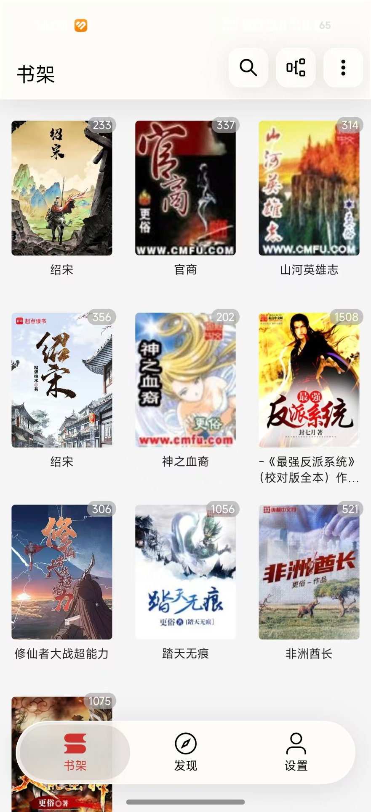
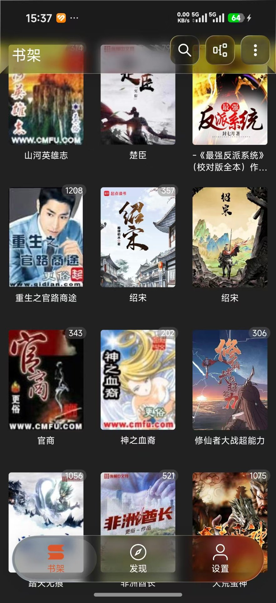

# 567Reader（阅读567）

[](https://www.android.com)
[](https://developer.android.com)
[](https://kotlinlang.org)
[](https://developer.android.com/jetpack/compose)
[](https://gradle.org)
[](LICENSE)

**567Reader**（应用显示名「阅读567」，包名 `com.qreader.reader`）是一款基于 [Legado（阅读）](https://github.com/gedoor/legado) 二次开发的 Android 阅读器，由 legado-E（阅读 Sigma）fork 而来。在继承 Legado 完整书源体系与阅读能力的基础上，重做了主界面架构（Jetpack Compose 全页迁移），落地了**液态玻璃（Liquid Glass）**主题系统，并针对墨水屏设备做了专项适配。

> 软件本身不提供任何内容，书籍内容均来自用户自行添加的第三方书源或本地文件。

---

## 目录

- [截图预览](#截图预览)
- [主要特性](#主要特性)
- [技术架构](#技术架构)
- [项目结构](#项目结构)
- [构建与运行](#构建与运行)
- [快速开始](#快速开始)
- [API 说明](#api-说明)
- [开源协议与致谢](#开源协议与致谢)
- [免责声明](#免责声明)

---

## 截图预览

下面是 567Reader 在小米（HyperOS）设备上的实机截图，展示了液态玻璃（Liquid Glass）主题系统在浅色与深色模式下的主界面、书架与底部导航栏玻璃态效果：

| 浅色模式 | 深色模式 |
|:---:|:---:|
|  |  |


---

## 主要特性

### 阅读与内容

| 特性 | 说明 |
|------|------|
| 自定义书源 | 通过规则抓取网页数据，支持搜索、发现、目录、正文解析，规则简单易懂 |
| 订阅源 / 替换规则 | 订阅任意 RSS 类内容；替换净化可批量去除广告与冗余文本 |
| 本地阅读 | 支持 TXT、EPUB、PDF、MOBI、AZW / AZW3 等格式 |
| 高度自定义阅读界面 | 字体、颜色、背景、行距、段距、加粗、简繁转换等均可配置 |
| 多种翻页模式 | 覆盖、仿真、滑动、滚动等 |
| 语音朗读（TTS） | 内置朗读引擎与在线朗读（Http TTS）支持 |
| 音频播放 | 带歌词的音频播放（基于 LyricViewX） |

### 现代化界面（本项目新增）

| 特性 | 说明 |
|------|------|
| 液态玻璃 UI | 基于 Kyant Backdrop 的玻璃态卡片、对话框与底部导航栏，支持模糊半径、折射高度/强度、色差等参数实时调节 |
| 墨水屏（EInk）模式 | 对玻璃态、对话框、深色列表等做专项降级，适配墨水屏设备刷新特性 |
| 多主题模式 | 浅色 / 深色 / 跟随系统 / 墨水屏，主题切换即时套用 |
| Compose 主界面 | 主界面三页（书架/发现/设置）全量 Compose 化，HorizontalPager 替换 ViewPager |
| 玻璃态弹框系统 | 排序、主题模式、编辑分组、分组切换等弹框统一使用 LiquidGlassDialog 玻璃态 |

#### 液态玻璃主题系统

玻璃态基于 Kyant Backdrop 实现：通过 `layerBackdrop` 捕获屏幕真实内容作为采样源，在导航栏 / 标题栏 / 弹框等浮层上用 `drawBackdrop` 叠加 `vibrancy`（鲜活度）+ `blur`（模糊）+ `lens`（折射）三层效果，玻璃下方能透出被模糊与折射的真实页面内容。

**可调参数（集中在 `GlassConfig`）**：模糊半径 `12dp`、透镜折射 `24×48dp`、开启色差（`chromaticAberration`），对齐官方 GlassPlayground 的 `blur / refractionHeight / refractionAmount / chromaticAberration` 四项。折射采样真实化——backdrop 挂在包裹 Pager 的层上，直接采样真实页面而非占位渐变，因此导航栏与标题栏的折射会随页面滚动实时变化。底部导航栏内置「玻璃设置」页，可实时调节上述参数并即时生效。

**玻璃组件清单**：
- `LiquidBottomTabs`：底部导航栏玻璃态胶囊栏
- `GlassTitleBar` / `BookshelfGlassTitleBar` / `ExploreGlassTitleBar`：各页玻璃标题栏（内含玻璃态搜索框、分组 / 更多按钮）
- `LiquidGlassDialog`：通用玻璃弹框（蒙板 + 圆角玻璃卡片），排序 / 主题模式 / 编辑分组 / 分组切换 / 删除书籍统一复用
- `LiquidToggle`：设置页玻璃态开关

主题方面，玻璃在浅色主题下为高不透明度暖白（卡片底色 `#FFFDF8`）、深色主题下为深灰；弹框配色同样跟随明暗主题，墨水屏下走黑白高对比分支。

#### 墨水屏（EInk）专项降级

墨水屏刷新慢、易残影，玻璃态的大面积模糊与持续重绘会严重拖累可读性与刷新，因此对该模式做专项降级：

- **玻璃浮层降级为纯色**：导航栏由 `LiquidBottomTabs` 退化为纯色 `EInkBottomBar`，标题栏由 `GlassTitleBar` 退化为纯色 `EInkTitleBar`；
- **玻璃弹框降级为黑白高对比**：弹框配色走 `glassDialogColors` 的 E-Ink 分支——卡片为纯白、蒙板与压暗层透明（不再压暗背景），仅靠纯色卡片与文字区分层级，避免玻璃模糊产生残影；
- **深色列表 / 对话框同步适配**墨水屏刷新特性，减少动态重绘。

### 数据与互通

| 特性 | 说明 |
|------|------|
| Web 服务 | 内置 NanoHTTPD 局域网服务，可在浏览器管理书籍/书源 |
| API | 提供 ContentProvider 与 Web 两种调用方式，支持 `legado://` / `yuedu://` 一键导入 |
| 备份恢复 | WebDAV、本地导出导入、旧版 Legado 数据迁移 |

---

## 技术架构

### 技术栈

| 层面 | 选型 | 版本 |
|------|------|------|
| 语言 | Kotlin（JVM 17） | 2.4.10 |
| UI 框架 | Jetpack Compose（Material3）+ 传统 View 混合 | BOM 2025.08 |
| 玻璃态 | [Kyant Backdrop](https://github.com/kyant0/backdrop) + Shapes | 2.0.1 / 1.2.1 |
| 本地存储 | Room（KSP 代码生成）+ SharedPreferences | KSP 2.3.11 |
| 网络 | OkHttp + Cronet | — |
| 解析 | Jsoup / JsoupXpath / JsonPath / Rhino（JS 引擎） | — |
| 图片 | Glide（KSP 注解 + Compose 集成） | — |
| Web 服务 | NanoHTTPD | — |
| 其他 | ZXing、Markwon、sora-editor、libarchive、HanLP | — |
| 构建 | Gradle + AGP | 9.7.1 / 9.3.2 |

### Compose 化进度

核心页面已完成 Compose 化，全部复用同一套液态玻璃主题系统：

- **MainScreen**：HorizontalPager 三页（书架 / 发现 / 设置）+ 玻璃态底部导航栏 + 玻璃标题栏
- **BookshelfPage**：书架页（RecyclerView 经 AndroidView 桥接，逻辑不变）
- **ExplorePage**：发现页（书源浏览）
- **SearchScreen**：搜索页（还原 legado-E 原生 UI 与搜索逻辑）
- **BookInfoScreen**：书籍信息页（封面 / 标签 / 简介经 AndroidView 桥接）
- **MySettingsScreen**：设置页（玻璃态分组卡片 + 玻璃态开关）
- **玻璃弹框系统**：LiquidGlassDialog、SortDialogOverlay、GroupEditOverlay、GroupDrawerOverlay，以及编辑分组、删除书籍、主题模式等弹框统一玻璃态

#### 阅读页玻璃面板（本项目新增）

阅读页所有设置与功能弹层已全部 Compose 化为 `*GlassSheet`，与设置面板同构（`LiquidGlassDialog` + `GlassConfig` 单一真源），真采样正文：

| 面板 | 说明 |
|------|------|
| 设置 | 进度条行为 / 音量键 / 亮度等偏好 |
| 界面 | 字体/粗细/缩进/简繁/滑杆/翻页动画/颜色/背景图 |
| 自动翻页 | 速度调节 + 目录/菜单/停止/翻页动画设置 |
| 点击区域 | 9 区域动作配置（玻璃浮层，写 PreferKey） |
| 边距 | 页眉/正文/页脚四向滑杆 + 分割线开关 |
| 书签 | 章节名 + 双输入 + 删除/确定（仅阅读页） |
| 信息栏 | 标题模式/字号/页眉页脚槽位/颜色入口 |
| 文字/背景 | 名称/恢复/深色状态栏/下划线/颜色/透明度/预置图 |
| 朗读设置 | Preference 托管（ignoreAudioFocus / 按页读 / TTS 引擎等） |
| 朗读主面板 | 上/下章 + 播控 + 定时 + 语速 + 目录/菜单/后台/设置 |
| 书内搜索 | 上一条/下一条圆钮 + 信息行 + 搜索结果/主菜单/退出 |
| 换源 | ChangeBookSourceViewModel + Adapter 托管 |
| 目录 | 纯 Compose LazyColumn，对齐 legado 原版 item（高亮/VIP/字数/缓存图标） |

共享组件：`GlassSheetComponents`（`GlassSliderRow` / `GlassToggleRow`）。  
`BaseDialogFragment` 对非 E-Ink 弹框统一应用 `GlassConfig.sheetCornerRadius` + 容器色（P1 视觉批量）。

暂不迁移的模块：阅读器（Canvas 手绘翻页）、漫画阅读器、WebView。

---

## 项目结构

```
567Reader/
├── app/                          # 主应用模块
│   ├── src/main/java/            # Kotlin/Java 源码（800+ .kt 文件）
│   │   └── com/qreader/reader/
│   │       ├── ui/main/          # 主界面 Compose 页面
│   │       │   ├── MainScreen.kt        # 主界面壳（Pager + 导航栏 + 标题栏）
│   │       │   ├── BookshelfPage.kt     # 书架页
│   │       │   ├── ExplorePage.kt       # 发现页
│   │       │   ├── my/MySettingsScreen.kt # 设置页
│   │       │   ├── SortDialogOverlay.kt # 排序弹框
│   │       │   ├── GroupDrawerOverlay.kt # 分组抽屉
│   │       │   └── bookshelf/           # 书架 ViewModel + Adapter
│   │       ├── ui/book/          # 书籍相关 Compose 页面
│   │       │   ├── search/SearchScreen.kt   # 搜索页（还原 legado-E UI）
│   │       │   ├── info/BookInfoScreen.kt   # 书籍信息页
│   │       │   ├── read/            # 阅读页（ReadBookScreen + 玻璃面板家族）
│   │       │   └── toc/TocGlassSheet.kt     # 目录面板（纯 Compose）
│   │       ├── ui/compose/       # Compose 通用组件
│   │       │   ├── glass/        # 玻璃态组件（LiquidGlassDialog、GlassDialogTokens）
│   │       │   └── liquid/       # 液态导航栏组件
│   │       ├── data/             # Room 数据库、DAO、Entity
│   │       ├── model/            # 业务模型、解析规则
│   │       ├── help/             # 工具类、配置、网络、协程
│   │       ├── service/          # 后台服务（TTS、Web、BookAudio）
│   │       └── ...
│   ├── src/main/res/             # 资源文件（~160 个 XML 布局、多语言）
│   └── build.gradle              # 应用构建配置
├── modules/
│   ├── book/                     # 书源 / 书籍解析核心逻辑
│   ├── rhino/                    # Rhino JavaScript 引擎封装
│   └── web/                      # Vue 3 前端（书源管理 Web UI）
│       ├── src/                  # Vue 源码（17 个 .vue 文件）
│       └── scripts/              # 构建脚本
├── gradle/
│   ├── libs.versions.toml        # 版本目录（统一依赖管理）
│   └── wrapper/                  # Gradle Wrapper (9.7.1)
├── CHANGELOG.md                  # 变更日志
└── README.md                     # 本文件
```

### 关键架构决策

| 决策 | 说明 |
|------|------|
| 玻璃弹框必须在 `layerBackdrop` 捕获层之外 | 渲染在 MainScreen 全屏外层 Box 直接子节点，复用 MainScreen 的 backdrop，避免循环捕获崩溃 |
| 分组/排序状态提升到 MainScreen | `currentGroupId`、`bookshelfSort` 等状态在 MainScreen 持有，通过 lambda 参数注入 BookshelfPage |
| RecyclerView 经 AndroidView 桥接 | 书架列表保留 RecyclerView（性能优势），通过 AndroidView 嵌入 Compose |
| Compose 手势 API | `awaitEachGesture` / `awaitFirstDown` 在 `foundation.gestures` 包（非 `pointer.util`）|

---

## 构建与运行

### 环境要求

| 工具 | 版本 |
|------|------|
| Android SDK | compileSdk 37，minSdk 33，targetSdk 36 |
| JDK | 17（通过 Gradle toolchain 自动指定） |
| Gradle | 使用仓库自带 `gradlew`（9.7.1） |
| Android Studio | 建议最新稳定版 |

### 构建命令

```bash
# 调试包
./gradlew :app:assembleAppDebug

# 正式包（需在 local.properties / 环境变量中配置签名）
./gradlew :app:assembleAppRelease
```

产物输出为 `app/build/outputs/apk/app/debug/567Reader.apk`。

### 安装到设备

```bash
# USB 安装
adb install app/build/outputs/apk/app/debug/567Reader.apk

# 小米设备可能需要 pm install 方式（绕过 INSTALL_FAILED_USER_RESTRICTED）
adb push app/build/outputs/apk/app/debug/567Reader.apk /data/local/tmp/567Reader.apk
adb shell pm install /data/local/tmp/567Reader.apk
adb shell rm /data/local/tmp/567Reader.apk
```

### 镜像仓库

若无法连接 Google / Maven Central 源，可在 `settings.gradle` 中取消注释对应的阿里云 / 华为云镜像。

### 导入到 Android Studio

1. 打开 Android Studio（建议最新稳定版）。
2. `File → Open` 选择本仓库根目录。
3. 等待 Gradle 同步完成后直接运行 `app` 模块。

---

## 快速开始

1. 首次启动进入欢迎页，按需授予存储权限。
2. 进入「书源管理」导入书源（支持扫码、URL、`legado://` 一键导入、本地文件）。
3. 回到书架搜索书名，或进入「发现」浏览书源内置分类。
4. 在「设置」中可切换主题、开启墨水屏模式、调整液态玻璃参数等。

新用户可参考帮助文档（应用内「设置 → 帮助」或 Legado 社区 wiki）。

---

## API 说明

阅读 3.0 提供两种调用方式：`Web 方式` 与 `Content Provider 方式`。

通过 URL 唤起阅读进行一键导入：

```
legado://import/{path}?src={url}
```

`path` 类型：

| 路径 | 说明 |
|------|------|
| `bookSource` | 书源 |
| `rssSource` | 订阅源 |
| `replaceRule` | 替换规则 |
| `textTocRule` | 本地 TXT 目录规则 |
| `httpTTS` | 在线朗读 |
| `theme` | 主题 |
| `readConfig` | 阅读排版 |
| `dictRule` | 字典 |
| `addToBookshelf` | 加入书架 |

---

## 开源协议与致谢

本项目由 legado-E（阅读 Sigma）fork 而来，上游继承自 [Legado（开源阅读）](https://github.com/gedoor/legado)，遵循其开源协议精神。

### 核心依赖

| 类别 | 依赖 |
|------|------|
| UI | Jetpack Compose、Material3、Kyant Backdrop（Liquid Glass） |
| 网络 | OkHttp、Cronet |
| 解析 | Jsoup、JsoupXpath、JsonPath、Rhino |
| 存储 | Room、SharedPreferences |
| 图片 | Glide |
| 媒体 | ExoPlayer、LyricViewX |
| Web | NanoHTTPD |
| 其他 | ZXing、Markwon、sora-editor、libarchive、HanLP、epublib |

完整依赖见 `gradle/libs.versions.toml` 和 `app/build.gradle`。

---

## 免责声明

阅读依赖系统 WebView 提供网页访问能力，通过用户自定义的第三方书源返回内容，软件对返回内容概不负责，亦不承担任何法律责任。任何第三方书源均系他人制作或提供，非软件作者，对其合法性概不负责。您应对搜索结果自行承担风险。如认为某书源涉嫌侵权，请及时通知，软件将依法处理。
